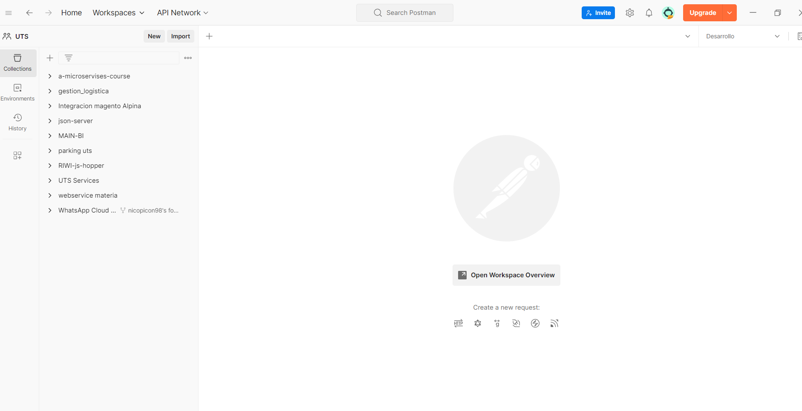
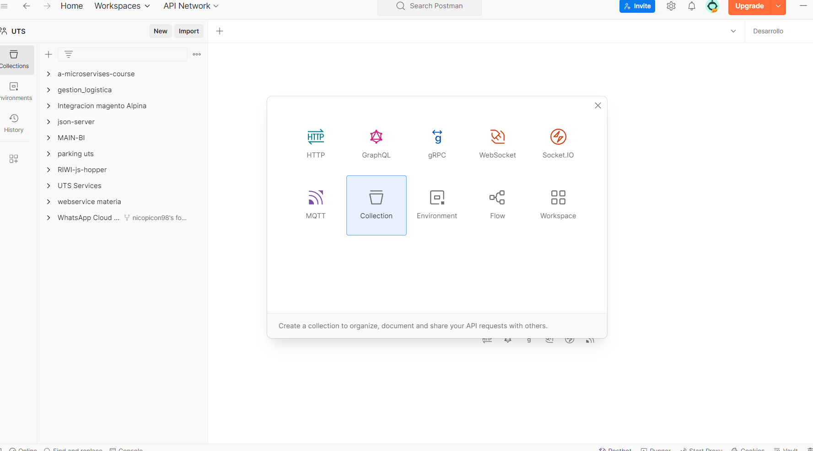
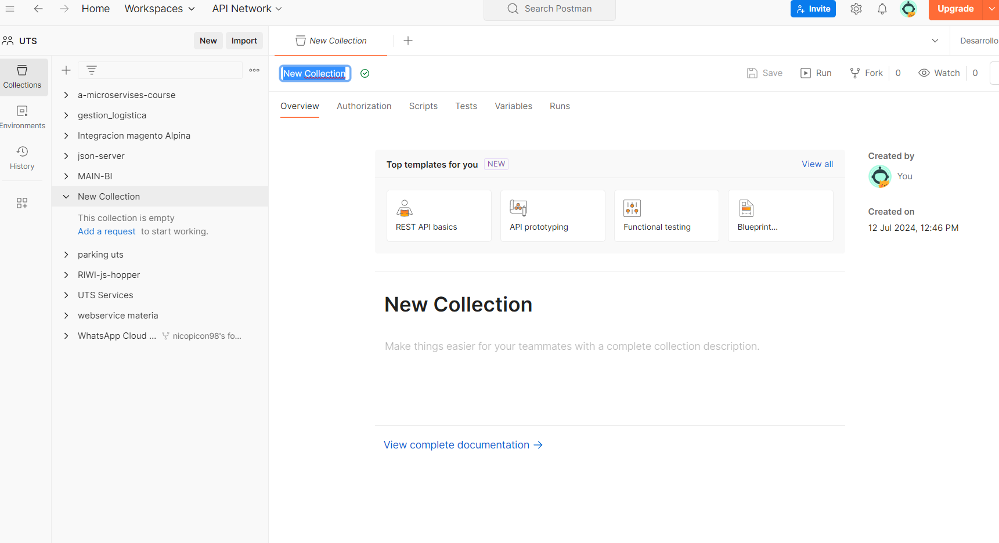
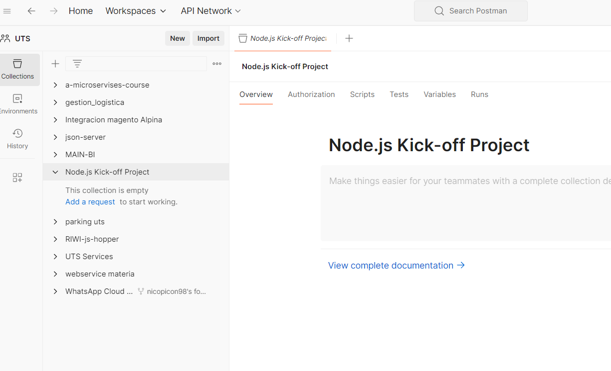
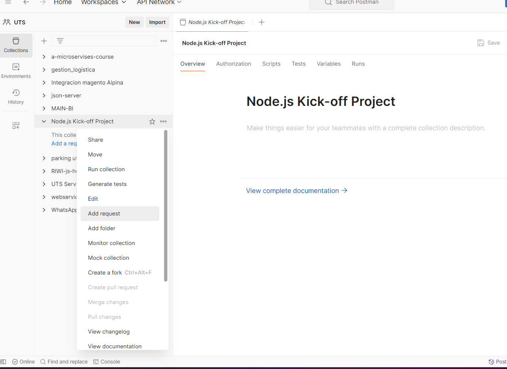
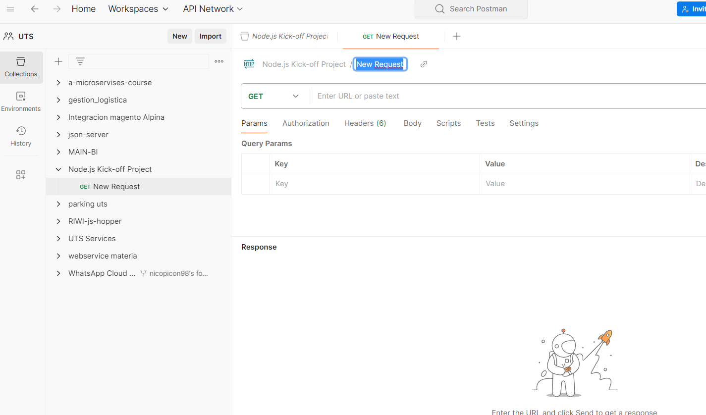
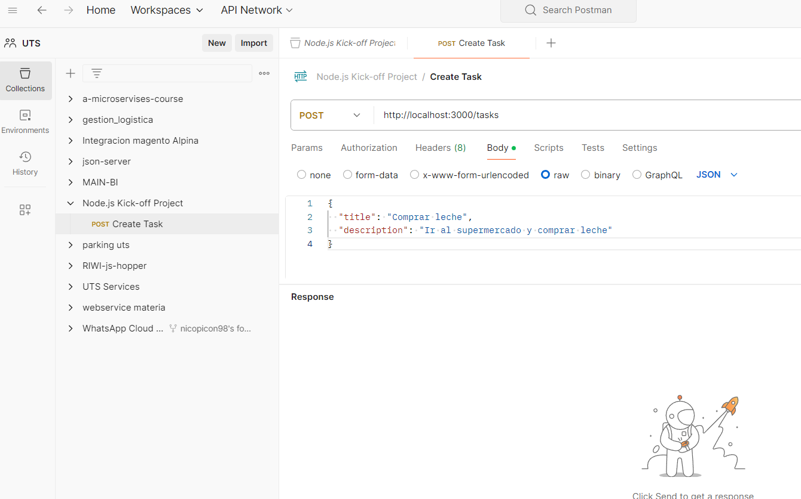
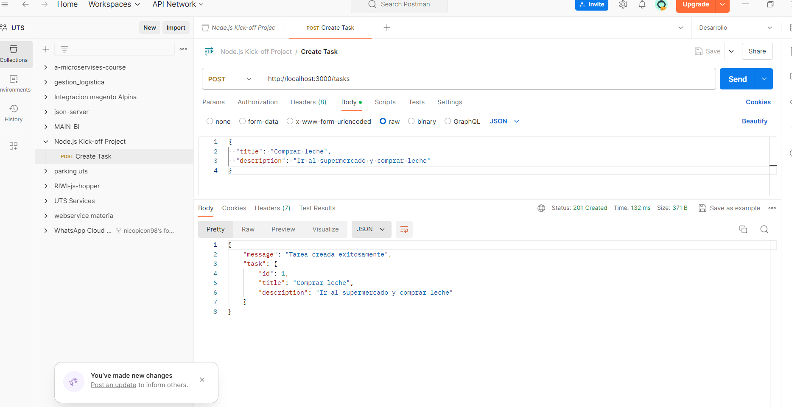
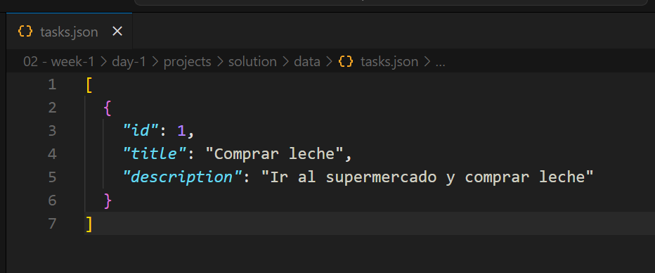

# Node.js Kick-off Workshop: Proyecto Real

## Introducción
Bienvenidos al proyecto de introducción a Node.js. Este proyecto está diseñado para aplicar los conceptos básicos de Node.js y Express que has aprendido durante la primera semana del curso. Crearás una API RESTful que interactúa con el sistema de archivos en lugar de una base de datos.

## Instrucciones de Entrega
1. Crea un repositorio en GitHub llamado `nodejs-first-project`.
2. Sigue las instrucciones y completa los objetivos establecidos en este documento.
3. Sube tu proyecto a GitHub y comparte el enlace del repositorio.

## Objetivos
- Configurar un entorno de desarrollo Node.js.
- Crear un servidor web utilizando Node.js y Express.
- Implementar rutas y middlewares en Express.
- Leer y escribir datos en el sistema de archivos utilizando el módulo `fs`.
- Manejar errores y asegurar la API con middlewares.

## Descripción del Proyecto
Crearás una API RESTful para gestionar una lista de tareas (To-Do List). Las tareas se almacenarán en un archivo JSON en el sistema de archivos.

## Historias de Usuario

### 1. Como usuario, quiero poder crear una nueva tarea para agregarla a mi lista de tareas.
- **Ruta:** POST `/tasks`
- **Cuerpo de la solicitud:**
  ```json
  {
    "title": "Nombre de la tarea",
    "description": "Descripción de la tarea"
  }
  ```
- **Respuesta:**
  ```json
  {
    "message": "Tarea creada exitosamente",
    "task": {
      "id": 1,
      "title": "Nombre de la tarea",
      "description": "Descripción de la tarea"
    }
  }
  ```

### 2. Como usuario, quiero poder ver todas mis tareas para revisarlas.
- **Ruta:** GET `/tasks`
- **Respuesta:**
  ```json
  [
    {
      "id": 1,
      "title": "Nombre de la tarea",
      "description": "Descripción de la tarea"
    },
    ...
  ]
  ```

### 3. Como usuario, quiero poder ver una tarea específica por su ID para conocer sus detalles.
- **Ruta:** GET `/tasks/:id`
- **Respuesta:**
  ```json
  {
    "id": 1,
    "title": "Nombre de la tarea",
    "description": "Descripción de la tarea"
  }
  ```

### 4. Como usuario, quiero poder actualizar una tarea existente para modificar su información.
- **Ruta:** PUT `/tasks/:id`
- **Cuerpo de la solicitud:**
  ```json
  {
    "title": "Nuevo nombre de la tarea",
    "description": "Nueva descripción de la tarea"
  }
  ```
- **Respuesta:**
  ```json
  {
    "message": "Tarea actualizada exitosamente",
    "task": {
      "id": 1,
      "title": "Nuevo nombre de la tarea",
      "description": "Nueva descripción de la tarea"
    }
  }
  ```

### 5. Como usuario, quiero poder eliminar una tarea para mantener mi lista organizada.
- **Ruta:** DELETE `/tasks/:id`
- **Respuesta:**
  ```json
  {
    "message": "Tarea eliminada exitosamente"
  }
  ```

## Requisitos del Proyecto

### 1. Configuración del Entorno
- Descarga e instala Node.js desde [nodejs.org](https://nodejs.org/). Recomendamos la versión LTS.
- Verifica la instalación con los siguientes comandos:
  ```sh
  node -v
  npm -v
  ```

### 2. Inicialización del Proyecto
- Inicia un nuevo proyecto Node.js:
  ```sh
  mkdir nodejs-first-project
  cd nodejs-first-project
  npm init -y
  ```

### 3. Instalación de Dependencias
- Instala Express:
  ```sh
  npm install express
  ```

### 4. Creación de la API RESTful

#### Estructura del Proyecto
```
nodejs-first-project/
├── data/
│   └── tasks.json
├── src/
│   ├── routes/
│   │   └── tasks.js
│   ├── middlewares/
│   │   └── errorHandler.js
│   └── app.js
├── package.json
└── index.js
```

#### 1. Crear el archivo `tasks.json`
- Crea la carpeta `data` y el archivo `tasks.json`:
  ```sh
  mkdir data
  echo "[]" > data/tasks.json
  ```

#### 2. Crear el Servidor con Express
- Crea la carpeta `src` y el archivo `app.js`:
  ```js
  const express = require("express"); // Importamos Express
  const tasksRoutes = require("./routes/tasks"); // Importamos las rutas de la API
  const errorHandler = require("./middlewares/errorHandler"); // Importamos el middleware para manejo de errores

  const app = express(); // Instanciamos Express
  const PORT = 3000; // Puerto del servidor en donde se ejecutará la API

  app.use(express.json()); // Middleware para parsear el cuerpo de las solicitudes en formato JSON. Tambien conocido como middleware de aplicación.
  app.use("/tasks", tasksRoutes); // Middleware para manejar las rutas de la API. Tambien conocido como middleware de montaje o de enrutamiento.
  app.use(errorHandler); // Middleware para manejar errores.

  app.listen(PORT, () => {
    console.log(`Server running at http://localhost:${PORT}/`);
  });
  ```

#### 3. Crear las Rutas de la API
- Crea la carpeta `routes` y el archivo `tasks.js`:
  ```js
  const express = require("express");
  const fs = require("fs");
  const path = require("path");

  const router = express.Router();
  const tasksFilePath = path.join(__dirname, "../../data/tasks.json");

  // Leer tareas desde el archivo
  const readTasks = () => {
    const tasksData = fs.readFileSync(tasksFilePath); // Leer el archivo. Este poderoso metodo nos permite leer archivos de manera sincrona.
    return JSON.parse(tasksData); // Retornar los datos en formato JSON.
  };

  // Escribir tareas en el archivo
  const writeTasks = (tasks) => {
    fs.writeFileSync(tasksFilePath, JSON.stringify(tasks, null, 2)); // Escribir los datos en el archivo. Este poderoso metodo nos permite escribir archivos de manera sincrona.
  };

  // Crear una nueva tarea
  router.post("/", (req, res) => {
    const tasks = readTasks();
    const newTask = {
      id: tasks.length + 1, // simulamos un id autoincrementable
      title: req.body.title, // obtenemos el titulo de la tarea desde el cuerpo de la solicitud
      description: req.body.description, // obtenemos la descripcion de la tarea desde el cuerpo de la solicitud
    };
    tasks.push(newTask);
    writeTasks(tasks);
    res.status(201).json({ message: "Tarea creada exitosamente", task: newTask });
  });

  // Obtener todas las tareas
  router.get("/", (req, res) => {
    const tasks = readTasks();
    res.json(tasks);
  });

  // Obtener una tarea por ID
  router.get("/:id", (req, res) => {
    const tasks = readTasks();
    const task = tasks.find((t) => t.id === parseInt(req.params.id));
    if (!task) {
      return res.status(404).json({ message: "Tarea no encontrada" });
    }
    res.json(task);
  });

  // Actualizar una tarea por ID
  router.put("/:id", (req, res) => {
    const tasks = readTasks();
    const taskIndex = tasks.findIndex((t) => t.id === parseInt(req.params.id));
    if (taskIndex === -1) {
      return res.status(404).json({ message: "Tarea no encontrada" });
    }
    const updatedTask = {
      ...tasks[taskIndex],
      title: req.body.title,
      description: req.body.description,
    };
    tasks[taskIndex] = updatedTask;
    writeTasks(tasks);
    res.json({ message: "Tarea actualizada exitosamente", task: updatedTask });
  });

  // Eliminar una tarea por ID
  router.delete("/:id", (req, res) => {
    const tasks = readTasks();
    const newTasks = tasks.filter((t) => t.id !== parseInt(req.params.id));
    if (tasks.length === newTasks.length) {
      return res.status(404).json({ message: "Tarea no encontrada" });
    }
    writeTasks(newTasks);
    res.json({ message: "Tarea eliminada exitosamente" });
  });

  module.exports = router;
  ```

#### 4. Crear Middleware para Manejo de Errores
- Crea la carpeta `middlewares` y el archivo `errorHandler.js`:
  ```js
  const errorHandler = (err, req, res, next) => {
    console.error(err.stack);
    res.status(500).json({ message: "Ocurrió un error en el servidor" });
  };

  module.exports = errorHandler;
  ```

#### 5. Archivo de Entrada del Proyecto
- Crea el archivo `index.js` en la raíz del proyecto:
  ```js
  require("./src/app");
  ```

## 5. Ejecución del Proyecto
- Ejecuta el proyecto con el siguiente comando:
  ```sh
  node index.js
  ```

- Deberás ver un mensaje similar al siguiente:
  ```
  Server running at http://localhost:3000/
  ```

- Abre tu navegador y accede a [http://localhost:3000/tasks](http://localhost:3000/tasks) para probar la API.

## 6. Probando la API (Ejemplo con POST)

Para probar nuestra API, podemos utilizar herramientas como [Postman](https://www.postman.com/) o [Insomnia](https://insomnia.rest/). Descarga e instala una de estas aplicaciones para realizar las siguientes pruebas.

Para este ejemplo, consideraremos que estamos utilizando Postman. Una vez descargado e instalado, sigue los pasos a continuación:

1. Abre Postman y encontrarás una interfaz similar a la siguiente:



2. Le daremos click al boton `new` para crear una colección de peticiones. 

3. Se nos abrirá una venta donde elegiremos colección. En postman, las colecciones son grupos de peticiones que se pueden ejecutar juntas. Es mas que todo para organizar las peticiones que haremos a nuestra API y poder compartirlas con otros desarrolladores.



4. Le damos un nombre a nuestra colección, en este caso `Node.js Kick-off Project`. A este punto puedes indagar más sobre funcionalidades de postman como variables de entorno, autenticación, etc. Te dejaré un link a la documentación oficial de postman [aquí](https://learning.postman.com/docs/getting-started/introduction/). Y un video de youtube que explica como usar postman mas a profundidad [aquí](https://www.youtube.com/watch?v=iFDQ3NFs95M&list=PLDbrnXa6SAzUsLG1gjECgFYLSZDov09fO).





5. Ahora crearemos una petición para crear una tarea. Para ello, le daremos click al boton `...` que se encuentra al lado de la colección que acabamos de crear y seleccionaremos `Add request`.



6. Se nos abrirá una ventana donde podremos configurar nuestra petición. Le daremos un nombre a nuestra petición, en este caso `Create Task`. En el campo `Request URL` colocaremos la dirección de nuestra API, en este caso `http://localhost:3000/tasks`. En el campo `Request type` seleccionaremos `POST`. En el campo `Body` seleccionaremos `raw` y en el tipo de dato seleccionaremos `JSON` y en el campo inferior colocaremos el siguiente JSON:

```json
{
  "title": "Comprar leche",
  "description": "Ir al supermercado y comprar leche"
}
```





7. Ahora le daremos click al boton `Send` y veremos la respuesta de nuestra API.



A este punto, ya debes suponer que el archivo `tasks.json` creado en la carpeta `data` contiene la tarea que acabamos de crear. 



Si no ves una respuesta similar a la que se muestra en la imagen, es posible que haya un error en tu código. Revisa el paso a paso y asegúrate de que todo esté configurado correctamente.

## 7. Probando la API (Resto de Verbos HTTP)

Como trabajo autonomo, prueba el resto de los verbos HTTP que se mencionan en las historias de usuario los cuales son:

- GET `/tasks`
- GET `/tasks/:id`
- PUT `/tasks/:id`
- DELETE `/tasks/:id`

## 8. Preguntas de Reflexión y trabajo investigativo

1. ¿Qué es el filesystem (fs) en Node.js y para qué se utiliza?
  - __Respuesta:__ El modulo "fs" en Node es una herramienta que nos permite trabajar con archivos, se usa para leer, escripbir, actualizar y eliminar archivos, esto es muy util para programas donde es necesario guardar datos como en este proyecto leyendo el archivo JSON

2. ¿Qué es un middleware en Express y cuál es su propósito?
  - __Respuesta:__ un middleware es una funcion que tiene acceso a lo que se solicita como request, response y a la siguiente funcion middleware en el ciclo de peticion/respuesta del programa, se usa para modificar o acceder a la solicitud de respueta o terminar el ciclo ejecutando la respuesta. el middleware es usado comunmente para verificar si un usuario esa autenticado, para verificar datos de formularios o para cualquier cosa que necesite hacerse automaticamente en cada peticion

3. ¿Qué es un endpoint en una API RESTful y cuál es su función?
  - __Respuesta:__ Un endpoint en una API RESTful es una URL a la que accedemos para realizar operaciones especificas segun los recursos disponibles. Cada endpoint corresponde a una funcion especifica, como obtener datos, crear registros, actualizar los registros o eliminarlos, esta es la forma en que oganizamos las interacciones entre el cliente y el servidor en una API

4. ¿Qué son los verbos HTTP y cuáles son los más comunes?
  - __Respuesta:__ los verbos HTTP son metodos que indican la accion deseada para un recurso, los mas usados son:
      - __GET:__ Solicitar/llamar datos
      - __POST:__ Enviar datos para crear dentro de un recurso
      - __PUT:__ Enviar datos para actualizar
      - __DELETE:__ Eliminar datos

5. ¿Qué es JSON y por qué es utilizado en las API RESTful?
  - __Respuesta:__ JSON es un formato de intercambio de datos, es facil de entender para humanos y maquinas, es usado en las API RESTful porque es simple de generar y parsear tanto en el cliente como en el servidor, lo que facilita la comunincaciony el intercambio de datos entre las tecnologias.

6. En lo que respecta al envio de datos a lo largo de los verbos http responde:

    - ¿Qué es el body de una petición?
    - __Respuesta:__ El body en una peticion es la parte de una solicitud HTTP donde se envian datos adicionales al servidor. Se usa principalmente en verbos como POST  y PUT para enviar informacion que necesita ser procesada, como por ejemplo los detalles de un nuevo recurso o para actualizaciones de un recurso existente.

    - ¿Qué es el body de una respuesta?
    - __Respuesta:__ El body de una respuesta es la parte de la respuesta HTTP donde el servidot envia datos al cliente, este puede incluir cualquier cosa, desde datos de un recurso, mensajes de confirmacion de alguna accion realizada o un error

    - ¿Qué es el query de una petición?
    - __Respuesta:__ Es una parte de la URL que tiene pares de clave-valor que se envian al servidor para ajustar la respuesta, por ejemplo, en una solicitud GET, podrias usar un query para filtrar resultados o para especificar que parte de un recurso quieres obtener.

    - ¿Qué es el params de una petición?
    - __Respuesta:__ El params es el nombre que se le da a los parametros que se pasan en la ruta de la URL, son usados para identificar un recurso especifico o un grupo de ellos, por ejemplo, en ua rota definica como "/task/:id", el "id" es un parametro que te permite acceder y manipular una tarea especifica basada en su "id"

7. En lo que respecta al verbo POST responde:
    - ¿Qué es un verbo POST y cuál es su propósito?
    - __Respuesta:__ El verbo POST se usa para enviar datos al servidor con el proposio de crear un recurso, es como decirle al servidor: "aqui tienes esta informacion, crea algonuevo con ella"

    - ¿Cuándo se utiliza un verbo POST?
    - __Respuesta:__ se usa principalmente cuando quieres añadir u nuevo registro o informacion a la base de datos o enviar algo al servidor como agregar una nueva tarea en la API de tareas

    - ¿En qué se diferencia un verbo POST de los otros verbos HTTP como GET, PUT y DELETE?
    - __Respuesta:__ GET solo solicita datos, no los modifica, POST se usa para crear nueva informacion, PUt se usa para actualizar recursos existents y DELETE se usa para eliminar recursos

    - ¿Como se envian datos en un verbo POST?
    - __Respuesta:__ los datos se enian en el body de la solucion en formato JSON o form-data, el servidor luego lo interpreta y crea nuevos recursos basandose en la informacion recibida.

8. En lo que respecta al verbo GET responde:
    - ¿Qué es un verbo GET y cuál es su propósito?
    - __Respuesta:__ GET se utiliza para solicitar datos, no modifica ningun dato en el servidor, simpleente obtiene la informacion y la envia devuelta al cliente.

    - ¿Cuándo se utiliza un verbo GET?
    - __Respuesta:__ se usa si quieres rcuperar informacion como obtener una lista de todas las tareas o detalles de una tarea especifica

    - ¿En qué se diferencia un verbo GET de los otros verbos HTTP como POST, PUT y DELETE?
    - __Respuesta:__ GET SOLO lee y recupera datos sin hacer cambios

9. En lo que respecta al verbo PUT responde:
    - ¿Qué es un verbo PUT y cuál es su propósito?
    - __Respuesta:__ PUT se usa para actualizar un recurso existente en su totalidad, si envias una solicitud PUT, se espera una version actualizada del recurso.

    - ¿Cuándo se utiliza un verbo PUT?
    - __Respuesta:__ se usa cuando necesitas actualizar un recurso existente como actualizar un titulo, una descripcion o cualquier parametro del recurso.

    - ¿En qué se diferencia un verbo PUT de los otros verbos HTTP como POST, GET y DELETE?
    - __Respuesta:__ PUt se diferencia de los otros verbos porque reemplaza un recurso existente con una nueva version del mismo u otro diferente

10. En lo que respecta al verbo DELETE responde:
    - ¿Qué es un verbo DELETE y cuál es su propósito?
    - __Respuesta:__ DELETE se usa para borrar un recurso especifico

    - ¿Cuándo se utiliza un verbo DELETE?
    - __Respuesta:__ se usa cuando quieres eliminar un recurso de forma permanente como por ejemplo una tarea de esta API

    - ¿En qué se diferencia un verbo DELETE de los otros verbos HTTP como POST, GET y PUT?
    - __Respuesta:__ DELETE se centra especificamente en la eliminacion de recursos, a diferencia de los otroa verbos que se usan para crear, consultar o actualizar.

11. ¿Qué es un status code y cuáles son los más comunes?
- __Respuesta:__  son codigos de respuesta estandar que indican si una solicitud es exitosa o no, ademas proporcionan informacion adicional sobre el resultado de la solicitud, los mas comunes son __200 OK__ que significa que la solicitud fue exitosa, __201 created__ que un recurso fue creado exitosamente, __400 bad request__ que la solicitud o fue entendida por algun error del cliente, __404 not found__ recurso no encontrado, __500 internal server error__ este ultimo es un error generico que sale cuando falla el servidor por cualquier razon.

12. ¿Cuales son los status code mas comunes para el verbo POST?
- __Respuesta:__ para el verbo POST los mas comunes son __201 Created__ que indica que fue creado exitosamente y __400 Bad Request__ que indica que los datos proporcionados no son validos

13. ¿Cuales son los status code mas comunes para el verbo GET?
- __Respuesta:__ para el verbo GET los mas comunes son __200 ok__ que indica que la solicitud fue procesada exitosamente y los datos son devueltos en respuesta y __404 not found__ que indica que el recurso solicitado no existe. 

14. ¿Cuales son los status code mas comunes para el verbo PUT?
- __Respuesta:__ para el verbo PUT son los mismos que para GET, __200 ok__ que indica que el recurso fue actualizado correctamente y el __404 not found__ que indica que el recurso que se intenta actualizar no existe o no lo encuentra

15. ¿Cuales son los status code mas comunes para el verbo DELETE?
- __Respuesta:__ para DELETE los mas comunes son __204 no content__ que indica que el recurso fue eliminado exitosamente y no hay nada que devolver y tambien __404 not found__ que significa que el recurso que intenta eliminar no lo encuentra o no existe.
